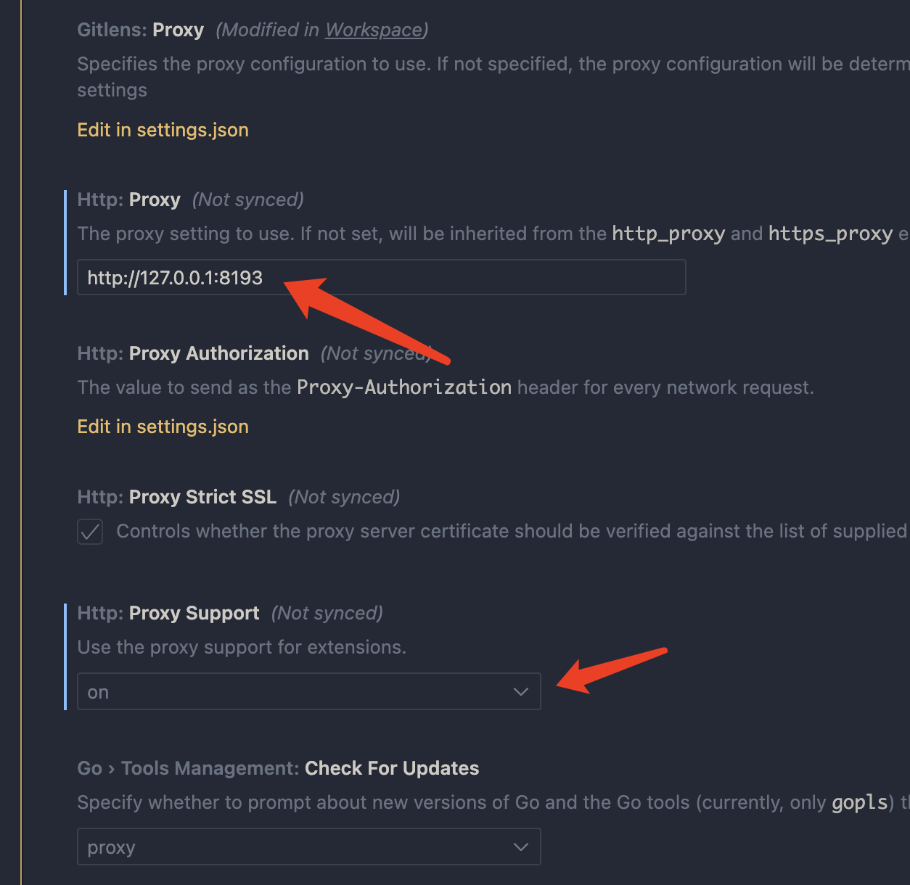

- Starting to learn [[Rust Lang]] by Chen Tian's Rust course https://time.geekbang.org/column/article/408409
	- **Installing tools & vscode**
		- https://rsproxy.cn/
			- 
		- after installed rust-analyzer, we may also need to enable proxy in vscode:
			- {:height 522, :width 655}
		-
	- random notes
		- feels much harder than previous languages - need to retake some fundamental CS
			- e.g., a string literal is stored in rodata, when copied to heap using `to_string` it will return a fat pointer with 3 parts: pointer, size and capacity
			  id:: 63a3ca04-6d48-4675-98a6-a1f6ed6d1dde
		- things to watch for
			- only see string literal use to_string to creating heap, but not seeing mem release?
		- defining functions
			- function parameter & return values must be explicitly typed. If the last expression in the function has no `;` at the end of the line, it will be the return value. If there is `;`, the return value is a void unit `()`
		- what is "borrow" and "move" in the context?
			- borrow: https://www.educative.io/answers/how-to-use-references-in-rust
				- When a function takes in a reference as a parameter, it is called borrowing.
				- Multiple *mutable* references to the same variable cannot exist within one scope.
				- A value cannot be borrowed as both immutable ref & mutable ref
		- 
			- type inference support backward tracking?
		- `2u8` number literal with the type to specify the type inline
		- there is no auto cast. eg., cannot compare i32 with u8 directly.
		- pattern match syntax sugar
			- 
		- use `mod` to import native modules, use `use` to import crates
		- tuple type in struct & enum
		- "所有权"
			- reference type & non-reference type? move?
			- https://course.rs/basic/ownership/ownership.html
	- 第一天学习感觉：不如Clojure有趣 🤔
-